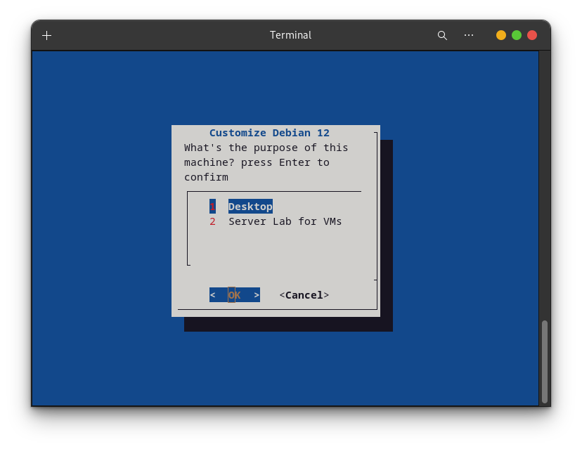
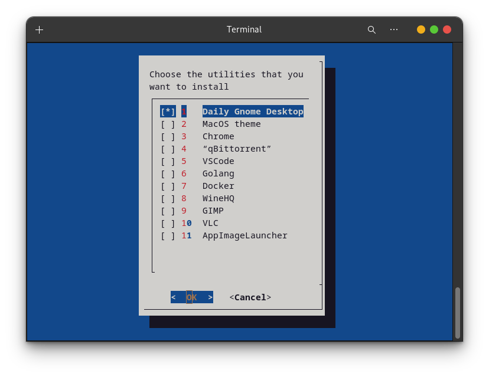

## Welcome
This is a repository for my own scripts mainly for debloat debian 12

I'm inspired by ChrisTitus' WinUtilities, which is great for desktop user to set up their workspace efficiently and elegently
This is his repository: https://github.com/ChrisTitusTech/winutil

if you have any question about scripts, 
please let me know to create an issue! :)

This project is highly experimental, DO NOT use it in development environment!
## How to use
Prerequisite: make sure you have `curl` installed
```bash
sudo apt install curl git -y
```

### run locally
```bash
git clone https://github.com/GeekerHWH/CustomizeDebian12.git
cd CustomizeDebian12/Scripts
chmod u+x main.sh
./main.sh
```

<!-- Execute the following command and Follow the TUI to finish installing your Debian, and you are done!
```bash
sudo bash -c "$(curl -fsSL https://raw.githubusercontent.com/GeekerHWH/CustomizeDebian12/main/CustomizeDebian12.sh)"
``` -->

> - Some softwares might need be installed in TUN proxy mode if you are in China

## Demo




## features
- [x] Quick install basic Gnome Desktop Environment
- [x] Install softwares like (MacOS theme / Docker / WineHQ)
- [x] Tweaks (experimental)
- [ ] Customize Server Lab (highly experimental)
