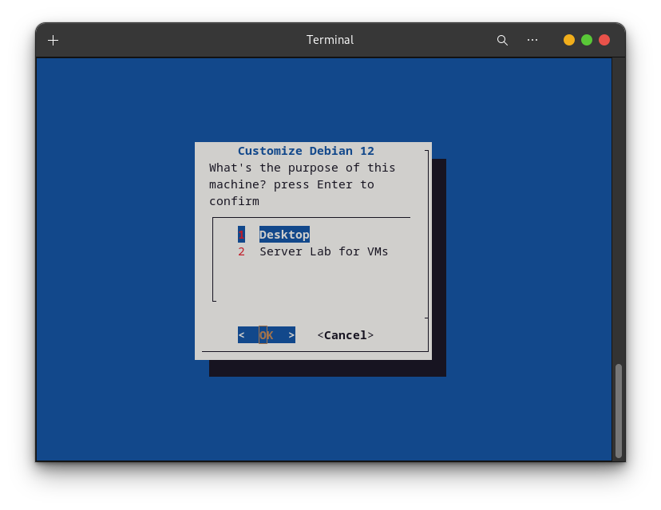
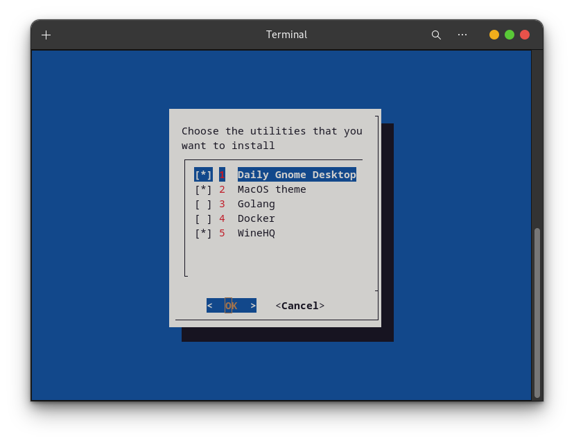
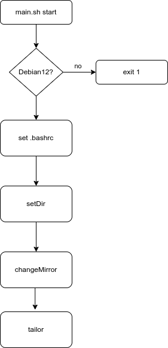

## Welcome
This is a repository for my own scripts mainly for debloat debian 12

I'm inspired by ChrisTitus' WinUtilities, which is great for desktop user to set up their workspace efficiently and elegently
This is his repository: https://github.com/ChrisTitusTech/winutil

Some of you might want to ask "hey, we've got apt instead, why to use your work?"
Well, some softwares do need gpg key and some stuffs, or some guys really hope to get a clean Debian system like me, or someone who need to set up his Desktop automatically and to drink a cup of coffee :P

All in all, hope you enjoy, staring this repo is the best support

if you have any question about scripts, 
please let me know to create an issue! :)

## How to use
```bash
git clone https://github.com/GeekerHWH/CustomizeDebian12.git
cd CustomizeDebian12/Scripts
chmod u+x -R main.sh modules/
sudo ./main.sh
# follow the TUI to finish installing your Debian, and you are done!
```

> - Some softwares might need be installed in TUN proxy mode if you are in China

## Demo




## features
- [x] Quick install basic Gnome Desktop Environment
- [x] Install softwares like (MacOS theme / Docker / WineHQ)
- [x] Tweaks (experimental)
- [ ] Customize Server Lab (experimental)

### Supported Desktop Softwares (Group if nums surpass 15)
- [x] VSCode
- [x] Docker
- [x] WineHQ
- [ ] Nvidia-driver
- [x] MacOS Theme
- [x] Golang
- [ ] Protobuf
- [ ] gRPC
- [ ] Nekoray
- [x] Chrome
- [x] qBittorrent
- [x] GIMP
- [x] VLC
- [x] AppImageLauncher

### ChangeMirror module is developing
https://github.com/GeekerHWH/CustomizeDebian12
